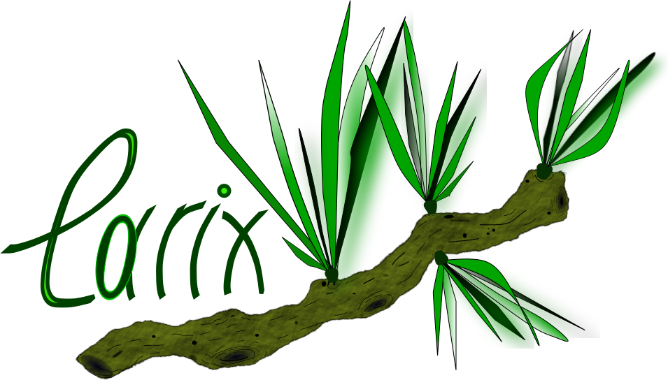
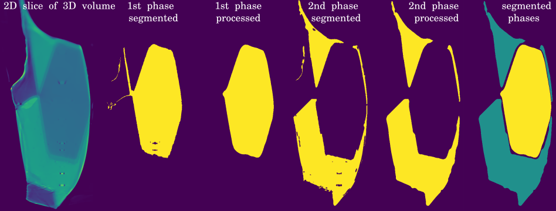

<table>
    <tr>
        <td>
        <div align="left">
          <br>
        </div>
        </td>
        <td>
        <font size="5"><b> Larix: is a set of data and image processing tools </b></font>
        <br><font size="3" face="verdana" color="green"><b> Larix</b> is an open-source software written in C/CUDA languages with wrappers for Python. The software consists of novel and already existing methods for various image processing tasks, e.g. segmentation, morphological processing, etc.  Most of the modules are implemented with OpenMP multithreading capability ensuring faster data processing. Larix is being developed at Diamond Light Source synchrotron with the main purpose to process collected data effectively and efficently.
        </font></br>
        </td>
    </tr>
</table>

| Master | Anaconda binaries |
|--------|-------------------|
| [](https://travis-ci.org/dkazanc/larix.svg?branch=master) |   [ ](https://anaconda.org/dkazanc/larix/) |

## Larix software includes:
 * Mask evolving segmentation method (RegionGrow) with mask initialisation (**2D/3D CPU**)
 * Morphological processing of the segmented image/volume (e.g. the result of RegionGrow) by removing various gaps and misclassified regions (**2D/3D CPU**)
 * Images 2D/3D auto cropping (when the object is within the FOV), implemented for tomographic projections

 <div align="center">
   
 </div>

## Installation
Here an example of build on Linux (see also `run.sh` for additional info):

```bash
git clone https://github.com/dkazanc/larix.git
mkdir build
cd build
cmake .. -DCONDA_BUILD=OFF -DBUILD_MATLAB_WRAPPER=ON -DBUILD_PYTHON_WRAPPER=ON -DCMAKE_BUILD_TYPE=Release -DCMAKE_INSTALL_PREFIX=./install
make install
cd install/python
export LD_LIBRARY_PATH=${LD_LIBRARY_PATH}:../lib
```

### Installation in Python (conda):
Install from the channel with `conda install -c dkazanc larix` or build with:
```
export VERSION=`date +%Y.%m`
conda build recipe/ --numpy 1.15 --python 3.5
conda install -c file://${CONDA_PREFIX}/conda-bld/ larix
```
Additionally you can also run/modify `conda_install.sh` for automatic conda build/install

#### Other useful software:
 * [ASTRA-toolbox](https://www.astra-toolbox.com/) versatile CPU/GPU toolbox for tomography
 * [ToMoBAR](https://github.com/dkazanc/ToMoBAR) TOmographic iterative MOdel-BAsed Reconstruction
 * [CCPi-RegularisationToolkit](https://github.com/vais-ral/CCPi-Regularisation-Toolkit) for regularisation of IR
 * [TomoPhantom](https://github.com/dkazanc/TomoPhantom) for tomographic simulation
